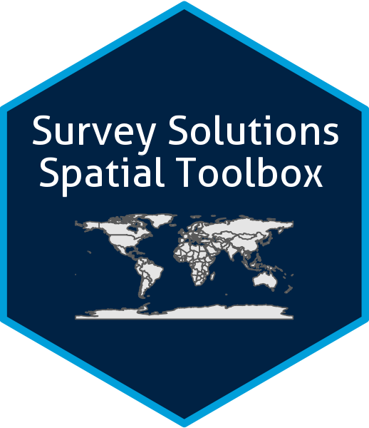

<!-- README.md is generated from README.Rmd. Please edit that file -->

<a href='https://docs.mysurvey.solutions/'>
</a>

# R/Shiny Application for Spatial Resource Creation

<!-- badges: start -->

[](https://lifecycle.r-lib.org/articles/stages.html#experimental)
<!-- badges: end -->

<div align="justify">

An R Shiny application to process shapefiles and generate boundary files
and base maps for the World Bank’s Survey Solutions CAPI system.

## 📋 Table of Contents

- [Features](#-features)
- [Installation](#-installation)
- [Start the Application](#-start-the-application)
- [How it Works](#-how-it-works)

------------------------------------------------------------------------

## ✨ Features

- **Upload Shapefiles**: Easily upload your own zipped shapefiles.
- **Interactive Map**: View your polygons on an interactive Leaflet map.
- **Download Table**: Download the polygon data in tabular
  representation for further processing.
- **Select Polygons**:
  - Click directly on the map to select individual polygons.
  - Upload a `.csv` file containing a list of polygon IDs to select them
    in bulk.
- **Generate Survey Solutions Files**:
  - Create the boundary file in *ESRI shape file format* required for
    geography questions.
  - Generate `.tpk` or `.tif` base maps for offline use in the Survey
    Solutions Interviewer App.
- **Download Outputs**: Download the generated files directly from the
  application.
- **Survey Solutions API Interface**: Send and assign spatial resources
  directly to the Survey Solutions server through the API interface.

## Important Note

The tool leverages external base map tile providers. Please be aware
that these services have their own Terms of Use. Some may require an API
key and/or may be subject to usage limits.

For the production of [Open Street
Map](https://www.openstreetmap.org/#map=5/38.00/-95.84), [ESRI world
imagery](https://www.arcgis.com/home/item.html?id=10df2279f9684e4a9f6a7f08febac2a9),
and [Mapbox](https://www.mapbox.com/) Maps, the tool uses the [R
basemaps package](https://github.com/16EAGLE/basemaps). Additionally
Mapbox maps also require a valid license key.

For the production of [ESRI .tpk
files](https://www.esri.com/en-us/arcgis/products/user-types/explore/creator),
you require a valid license key. The module uses its own API calls, and
credentials must be provided through the app.

We welcome your feedback! Please share your thoughts, suggestions, or
any issues you encounter in this thread.

## Installation

- Install R: <https://cran.r-project.org/mirrors.html> (version 4.1.1 or
  greater)

- Install R Studio: <https://rstudio.com/products/rstudio/download/>
  (version 1.2.5001-3 or newer)

- Make sure the *devtools* package is installed, if not install it with:

``` r
install.packages("devtools")
```

- After that install the actual package:

``` r
devtools::install_github("michael-cw/susobasemap")
```

## 🚀 Start the application

### From RStudio

``` r
library(susobasemap)
susobasemap::runBaseMapApp()
```

### On a Shiny Server

In case you are considering to run the application on a shiny server,
you just need to create the following app.R script in your shiny server
app directory:

``` r
library(susobasemap)
susobasemap::runBaseMapAppServer()
```

## How it works

Follow these steps to generate your Survey Solutions files:

1.  **Upload Shapefile**:

- In the “Upload shapefile” section, click “Browse…” and select a `.zip`
  file containing your shapefile (`.shp`, `.shx`, `.dbf`, etc.).
- The application will automatically unzip and load the shapefile.

2.  **Select a Unique ID**:

- Once the shapefile is loaded, you will be prompted to select the
  column from your shapefile’s attribute table that contains a unique
  identifier for each polygon. This is crucial for linking selections to
  the correct polygons.

3.  **Select Polygons**:
    - You have two options for selecting the polygons you want to
      include in your boundary file and base map:
      - **Option A: Select on Map**: Click on individual polygons on the
        interactive map. Selected polygons will be highlighted, and
        their IDs will appear in a table. You can deselect a polygon by
        clicking it again.
      - **Option B: Upload a List of IDs**: Upload a single-column
        `.csv` file containing the unique IDs of the polygons you wish
        to select. The application will match these IDs with the unique
        ID column you selected earlier.
4.  **Generate and Download Files**:
    - You will see a summary of your selected polygons in the “Selection
      Summary” section.
    - Move on to the “Download” section
      - Click **“Generate Boundary File”** to create the `.geojson` file
        for your Survey Solutions geography question.
      - Click **“Generate Base Map”** to create the offline map package
        (`.tpk` or `.mbtiles`).
      - Once generated, click the corresponding **“Download”** button to
        save the files to your computer.
      - The download button “Table” allows you to download the shape
        file data immediately after upload in tabular form, i.e. for
        sampling or other frame specfic activities.

</div>
